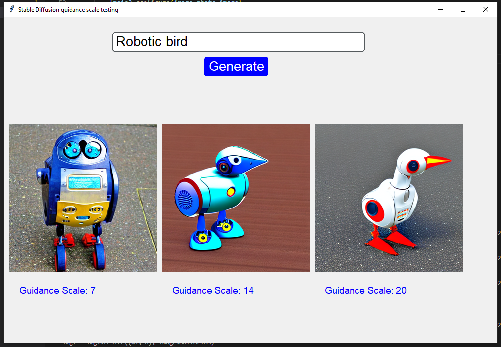

# Stable_diffusion_with_gui
A tkinter GUI for Stable Diffusion to test the effect of guidance score

## Requirements

You need python version 3.10.6, and a cuda enabled GPU on your system.

## Installation

1. Install python, ideally version 3.10.6, on your system. 
2. Download Ambia package files from this Git repository \
or you can use \
`Git clone https://github.com/mrymsadeghi/Stable_diffusion_with_gui.git` 
3. Use the requirements.txt file provided in the package to install the necessary python packages with optimal versions \
`pip install -r requirements.txt`
4. Run the app.py file to run Ambia

